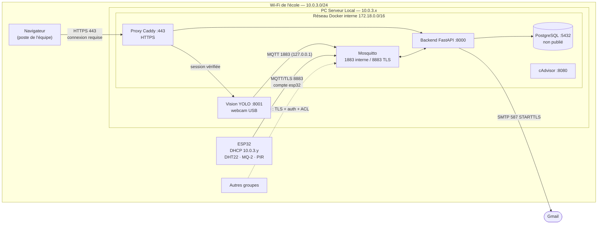

# Réseau de la table — SENTINEL-X (groupe 9)

Document destiné au dossier technique : architecture réseau retenue, plan d'adressage,
flux autorisés, isolation vis-à-vis des autres groupes, et amélioration prévue.

## 1. Architecture retenue

Le sujet propose deux options. Nous avons retenu l'**option B (« Edge-to-Server »)** : le rôle
de PC Serveur Local est tenu par l'ordinateur portable d'un membre du groupe. Il héberge la
stack Docker (broker MQTT, API, base de données, supervision) et le module de vision, avec la
webcam USB branchée directement dessus. Le boîtier ne contient que l'ESP32 et ses capteurs.

**Réseau utilisé : le Wi-Fi de l'école.** Le PC et l'ESP32 se connectent au Wi-Fi existant
de l'école au lieu d'un point d'accès propre à la table. C'est un choix de simplicité pour le
prototype : rien à installer, pas de deuxième carte Wi-Fi, et le PC garde son accès Internet
(envoi des mails d'alerte). Ce choix a deux conséquences, traitées plus bas :

1. **L'adresse IP du PC change** : elle est attribuée par le DHCP de l'école (section 4).
2. **Nous partageons le réseau avec les autres groupes** : l'isolation est assurée par des
   protections logicielles plutôt que par un réseau séparé (section 6). Un réseau privé
   dédié est l'amélioration prévue (section 8).

## 2. Schéma réseau

```
     ┌──────────────────── Wi-Fi de l'école — 10.0.3.0/24 (passerelle 10.0.3.1) ────────────────────┐
     │                                                                                              │
     │   Boîtier SENTINEL-X                       PC Serveur Local (Windows + Docker Desktop)       │
     │  ┌──────────────────┐                     ┌────────────────────────────────────────────────┐ │
     │  │ ESP32            │   MQTT sur TLS 1.2  │ carte Wi-Fi : 10.0.3.x (DHCP)                  │ │
     │  │ DHCP 10.0.3.y    │────────────────────►│   :8883  Mosquitto (TLS)  ← seul accès capteurs│ │
     │  │ DHT22 · MQ-2     │   port 8883         │                                                │ │
     │  │ PIR · OLED       │                     │   :443   HTTPS Caddy (dashboard, API, vidéo)   │ │
     │  │ buzzer · LEDs    │◄────────────────────│ boucle locale 127.0.0.1 uniquement :           │ │
     │  └──────────────────┘  commandes buzzer   │   :1883 MQTT clair   :8000 API   :8080 cAdvisor│ │
     │                        (même connexion)   │   :8001 flux vidéo   :5173 dashboard de dev    │ │
     │                                           │                                                │ │
     │   Autres groupes  ✗ ─ ─ ─ ─ ─ ─ ─ ─ ─ ─ ─►│ réseau Docker interne 172.18.0.0/16 :          │ │
     │   (même Wi-Fi)    pas de 1883, pas de     │   mosquitto · backend · db · proxy · cadvisor  │ │
     │                   5432, TLS + mot de      │   aucun port de la base publié                 │ │
     │                   passe sur 8883          └──────────────────┬─────────────────────────────┘ │
     │                                                              │ webcam USB                    │
     └──────────────────────────────────────────────────────────────┼───────────────────────────────┘
                                                                     ▼
                                                    Internet (SMTP Gmail 587, STARTTLS)
```

Version Mermaid (pour le poster ou le PowerPoint) :



## 3. Plan d'adressage

### Réseau de l'école (réseau physique)

| Élément | Valeur |
|---|---|
| Réseau | `10.0.3.0/24` |
| Masque | `255.255.255.0` |
| Passerelle | `10.0.3.1` |
| DNS | `172.16.1.41`, `172.16.1.42` (DNS de l'école) |
| Attribution | DHCP de l'école, aucune réservation possible |

| Équipement | Interface | Adresse | Attribution | Rôle |
|---|---|---|---|---|
| PC Serveur Local | carte Wi-Fi | `10.0.3.x` (ex. `10.0.3.173`) | DHCP | broker MQTT TLS (8883), HTTPS (443) |
| ESP32 | Wi-Fi | `10.0.3.y` | DHCP | publie les mesures, reçoit les commandes |
| Poste d'un autre membre (facultatif) | Wi-Fi | `10.0.3.z` | DHCP | ouvre le dashboard en HTTPS |

### Réseau Docker interne (sur le PC, invisible depuis le Wi-Fi)

Réseau `sentinelx_default` créé par Docker Compose, en pont (bridge) : `172.18.0.0/16`,
passerelle `172.18.0.1`. Les conteneurs s'appellent par leur nom de service (`mosquitto`,
`db`, `backend`), jamais par adresse IP : les adresses ci-dessous sont données à titre
indicatif et peuvent changer à chaque recréation.

| Conteneur | Adresse (indicative) | Ports internes |
|---|---|---|
| `mosquitto` | `172.18.0.3` | 1883 (clair), 8883 (TLS) |
| `db` | `172.18.0.4` | 5432 |
| `backend` | `172.18.0.5` | 8000 |
| `cadvisor` | `172.18.0.2` | 8080 |
| `proxy` | `172.18.0.6` | 8443 (publié en 443) |

### Boucle locale du PC

`127.0.0.1` : services réservés au PC lui-même (module vision, dashboard, supervision).

## 4. Gestion de l'adresse dynamique (DHCP de l'école)

L'ESP32 doit connaître l'adresse du PC (`MQTT_HOST`) et le certificat TLS du broker doit
contenir cette adresse : l'ESP32 vérifie que le serveur qui lui répond est bien celui écrit
dans le certificat. Comme l'adresse change, `lancer.ps1` automatise tout à chaque lancement :

1. **Détection** : il cherche la carte Wi-Fi physique connectée qui a une passerelle (le
   point d'accès mobile de Windows et les cartes virtuelles Docker/WSL sont ignorés). Si la
   détection se trompe : `.\lancer.ps1 -ForcerIp 10.0.3.42`.
2. **Configuration Docker** : l'adresse est écrite dans `SERVER_IP` du `.env`. Docker
   publie les ports 8883 et 443 **uniquement sur cette adresse** (et sur `127.0.0.1`).
   Si `SERVER_IP` manque, Docker refuse de démarrer, au lieu d'ouvrir les ports sur toutes
   les interfaces.
3. **Certificat** : si l'adresse n'est pas celle du certificat du broker, un nouveau
   certificat est signé pour la nouvelle adresse. **L'autorité de certification (CA) est
   conservée** : l'ESP32, qui ne connaît que la CA, n'a pas besoin d'un nouveau certificat.
4. **Firmware** : `MQTT_HOST` est mis à jour dans `firmware/sentinel_temp/secrets.h` et
   `ca_cert.h` est régénéré. Le script affiche un avertissement : il reste à reflasher
   l'ESP32 (par câble ou par OTA).
5. **Wi-Fi coupé** : repli sur `127.0.0.2`. La stack démarre quand même pour travailler en
   local, et un message indique que l'ESP32 ne pourra pas se connecter.

## 5. Ports exposés

| Service | Port | Écoute sur | Joignable depuis le Wi-Fi ? | Chiffré | Authentifié |
|---|---|---|---|---|---|
| Mosquitto TLS | 8883 | `SERVER_IP`, `127.0.0.1` | **oui** (ESP32) | TLS 1.2+ | compte + ACL |
| Proxy HTTPS (Caddy) | 443 | `SERVER_IP`, `127.0.0.1` | **oui**, pour les 5 postes autorisés (dashboard, API, vidéo) | TLS 1.2 / 1.3 | certificat client du poste, puis connexion et jeton JWT |
| API REST directe | 8000 | `127.0.0.1` | non | non (local) | jeton JWT |
| Mosquitto clair | 1883 | `127.0.0.1` | non | non (local) | compte + ACL |
| Module vision | 8001 | `127.0.0.1` | non (via le proxy, session vérifiée) | non (local) | via le proxy |
| Dashboard de dev (Vite) | 5173 | `127.0.0.1` | non | non (local) | connexion |
| cAdvisor | 8080 | `127.0.0.1` | non | non (local) | — |
| PostgreSQL | 5432 | réseau Docker interne | non (port non publié) | — | mot de passe |

## 6. Flux autorisés

| # | Source | Destination | Protocole / port | Chiffrement | Authentification | Usage |
|---|---|---|---|---|---|---|
| F1 | ESP32 | PC `SERVER_IP:8883` | MQTT sur TLS | TLS 1.2+, certificat vérifié par la CA | compte `esp32`, ACL (écrit `sensors`, lit `cmd`) | mesures capteurs, commandes buzzer |
| F2 | Module vision (PC) | `127.0.0.1:1883` | MQTT | non (ne quitte pas le PC) | compte `vision`, ACL (écrit `vision`) | détections de personnes |
| F3 | Backend (conteneur) | `mosquitto:1883` | MQTT | non (réseau Docker interne) | compte `backend`, ACL | lit capteurs, vision et statistiques `$SYS`, envoie les commandes |
| F4 | Backend | `db:5432` | PostgreSQL | non (réseau Docker interne) | mot de passe | enregistrement des données |
| F5 | Navigateur d'un poste autorisé | `SERVER_IP:443` | HTTPS, TLS mutuel | TLS 1.2 / 1.3 | certificat client `posteN`, puis connexion et jeton JWT (cookie) | dashboard, API, flux vidéo |
| F5b | Proxy Caddy (conteneur) | `backend:8000`, `host.docker.internal:8001` | HTTP | non (interne au PC) | jeton relayé, session vérifiée pour la vidéo | relais vers l'API et la vision |
| F6 | Backend | `smtp.gmail.com:587` | SMTP | STARTTLS | mot de passe d'application | mails d'alerte |
| F7 | Navigateur du PC | `127.0.0.1:8080` | HTTP | non (local) | — | supervision cAdvisor |

**Aucun autre service SENTINEL-X n'est joignable** : seuls 8883 et 443 sont publiés sur le
Wi-Fi, la base n'a aucun port publié et les autres services n'écoutent que sur `127.0.0.1`
(voir [securite.md](securite.md)).

## 7. Isolation par rapport aux autres groupes

Sur le Wi-Fi de l'école, tous les groupes sont dans le même réseau `10.0.3.0/24`. On ne peut
donc pas les empêcher de « voir » notre PC. L'isolation repose sur plusieurs couches de
protection successives (défense en profondeur) :

| Couche | Mesure | Ce que ça empêche |
|---|---|---|
| Exposition minimale | Seuls 8883 et 443 sont publiés sur l'adresse Wi-Fi. MQTT en clair, API directe, vision, base et supervision restent sur la boucle locale ou le réseau Docker interne | un attaquant ne trouve presque aucune porte ouverte (vérifiable avec `nmap`) |
| Chiffrement | MQTT de l'ESP32 en TLS, dashboard/API/vidéo en HTTPS, certificats signés par notre CA et contenant l'IP du PC | lecture des mesures sur le Wi-Fi (Wireshark), modification des trames, faux serveur (homme du milieu) |
| Postes autorisés | HTTPS en TLS mutuel : seuls les 5 postes de l'équipe, munis de leur certificat client, peuvent ouvrir `https://<IP>` | un autre groupe sur le même Wi-Fi n'obtient même pas la page de connexion |
| Authentification | MQTT : `allow_anonymous false`, un compte par composant. API et vidéo : connexion et jeton JWT. Mots de passe aléatoires générés par `lancer.ps1` | connexion d'un client inconnu au broker, commande du buzzer ou lecture des données par un autre groupe |
| Contrôle d'accès (ACL) | chaque compte ne lit ou n'écrit que ses topics | un compte volé ne donne pas accès à tout (ex. `esp32` ne peut pas lire la vision) |
| Conteneurs durcis | utilisateur non-root, `cap_drop: ALL`, système de fichiers en lecture seule, limites mémoire | un service compromis ne prend pas la main sur la machine |

**Limites connues, assumées pour le prototype :**

- Partager le réseau laisse possibles le **déni de service** (inonder le Wi-Fi ou le port
  8883) et l'**usurpation ARP**. Le TLS empêche de lire ou de falsifier les données, mais pas
  de couper la connexion.
- Le **profil réseau Windows du Wi-Fi de l'école est « Public »**. Si le pare-feu Windows
  bloque l'ESP32 ou les autres postes, ouvrir 8883 et 443 (commandes dans le README).

## 8. Amélioration prévue : un réseau privé dédié à la table

C'est ce que demande le sujet en version complète, et la principale évolution prévue.
L'idée : la table dispose de **son propre Wi-Fi**, séparé de celui de l'école.

**Comment** : un mini-routeur Wi-Fi ou une clé Wi-Fi USB en point d'accès sur le PC (le
point d'accès mobile de Windows dépanne mais impose sa plage `192.168.137.0/24`).

| Élément | Valeur proposée |
|---|---|
| SSID | `SENTINEL-G9` (masqué possible), WPA2-PSK ou WPA3, mot de passe fort |
| Bande | 2,4 GHz (l'ESP32 ne capte pas le 5 GHz) |
| Réseau | `192.168.10.0/24`, masque `255.255.255.0` |
| PC serveur | `192.168.10.1` (IP fixe, passerelle de la table) |
| ESP32 | `192.168.10.10` (IP fixe dans le firmware ou réservation DHCP sur l'adresse MAC) |
| Postes d'administration | DHCP `192.168.10.100` à `192.168.10.150` |
| Routage | aucun routage du réseau de table vers le Wi-Fi de l'école. Seul le PC sort sur Internet (mails), par sa propre carte |
| Filtrage | pare-feu : 8883 accepté uniquement depuis `192.168.10.10`, 443 uniquement depuis `192.168.10.0/24` |

**Ce que ça apporte :**

- **Isolation réelle** : les autres groupes ne sont plus sur le même réseau. Pour attaquer,
  ils devraient d'abord casser le mot de passe Wi-Fi.
- **Adresse fixe** : plus de reflash de l'ESP32 quand le DHCP de l'école change l'IP. Le
  certificat n'est signé qu'une fois.
- **Conformité au sujet** (« point d'accès Wi-Fi local dédié, routage étanche »).

**Pourquoi ce n'est pas en place** : il faut du matériel en plus (clé ou routeur) pour avoir
une plage d'adresses à nous. Le point d'accès mobile de Windows fonctionne sans matériel,
mais il impose `192.168.137.0/24` et partage la connexion de l'école par défaut (le réseau de
table n'est alors pas étanche). Le passage est simple : le code accepte déjà n'importe quelle
adresse serveur (`-ForcerIp 192.168.10.1`).

## 9. Vérifications (preuves pour la soutenance)

```powershell
# Adresse du PC et ports réellement publiés par Docker
ipconfig
docker compose ps

# Depuis un autre poste du Wi-Fi : seuls 8883 et 443 doivent apparaître
nmap -Pn -p 1-10000 <IP du PC>

# Le broker présente un certificat valide pour son IP, signé par notre CA
openssl s_client -connect <IP du PC>:8883 -CAfile mosquitto/certs/ca.crt -verify_ip <IP du PC> -brief

# Une connexion anonyme est refusée
mosquitto_sub -h <IP du PC> -p 8883 --cafile mosquitto/certs/ca.crt -t "#"

# Capture Wireshark sur le port 8883 : les trames sont illisibles (Application Data TLS)
```
